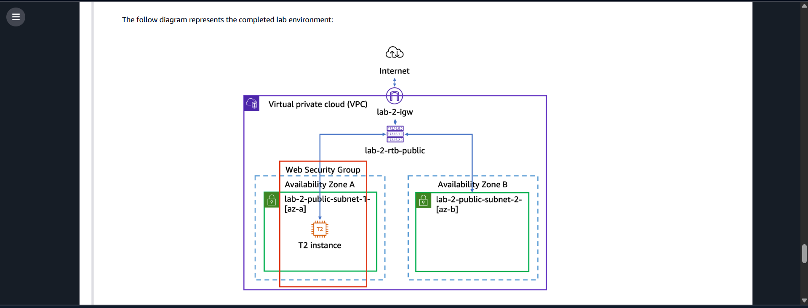
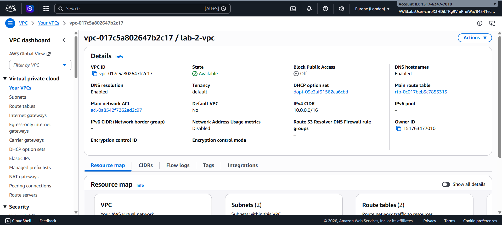
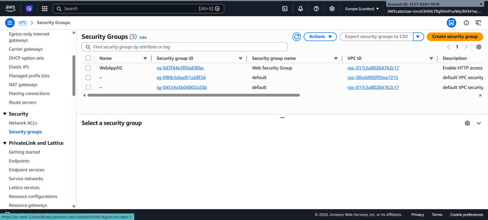
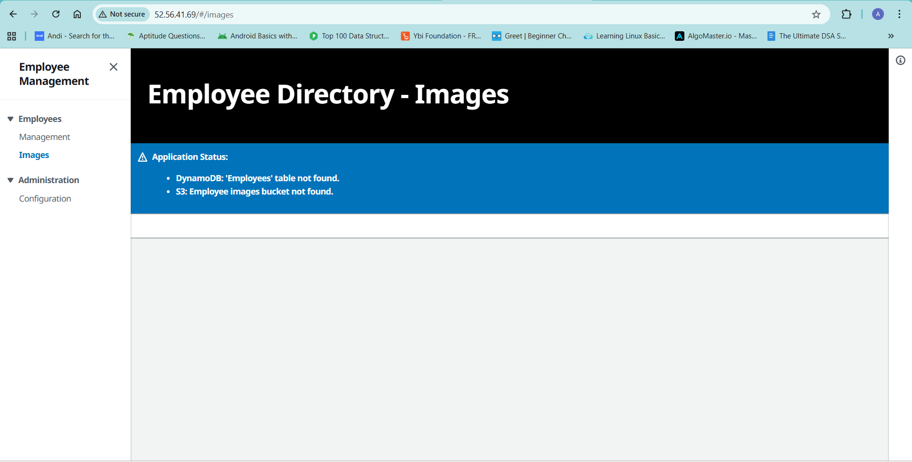

# AWS Lab 2 – VPC and EC2 Web Application

This lab demonstrates how to create a custom **Amazon VPC** and deploy a **web application on an EC2 instance** using a user data script.

## 🎥 Lab Video

Video walkthrough: https://youtu.be/6mAG1L2h1U0

## Lab Overview

In this lab I performed the following tasks:

- Created a **custom VPC**
- Created **two public subnets**
- Configured an **Internet Gateway**
- Created a **Route Table**
- Configured a **Security Group**
- Launched an **EC2 instance**
- Deployed a **web application using a user data script**

## Architecture

The following diagram shows the completed architecture.



Components used:

- VPC (`10.0.0.0/16`)
- Public Subnet 1 (`10.0.0.0/24`)
- Public Subnet 2 (`10.0.1.0/24`)
- Internet Gateway
- Route Table
- Security Group
- EC2 Instance

## VPC Configuration

The VPC was created with DNS hostnames and DNS resolution enabled.



## Security Group

A security group was created to allow web traffic.



## Application Output

After launching the EC2 instance and running the user data script, the web application was accessible using the **Public IPv4 address**.



Example:

```
[http://52.56.41.69/#/images](http://52.56.41.69/#/images)
```

## Conclusion

This lab helped me understand how **Amazon VPC networking components** work together with **Amazon EC2** to deploy and run a web application in the cloud.


