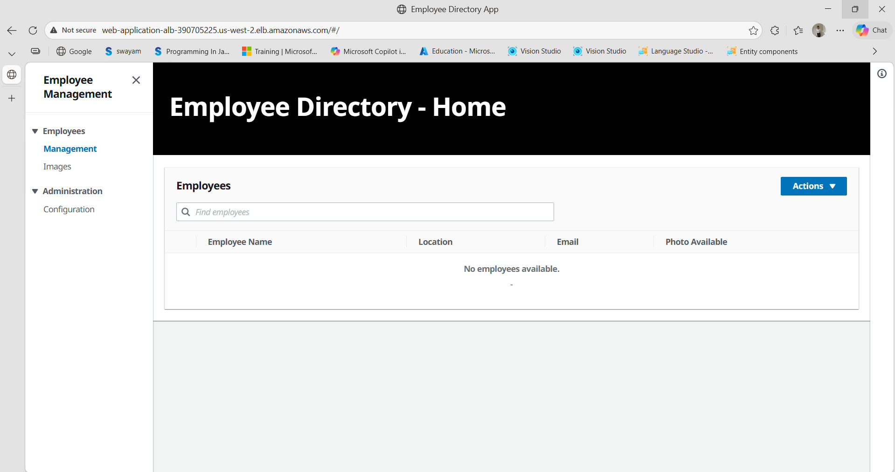
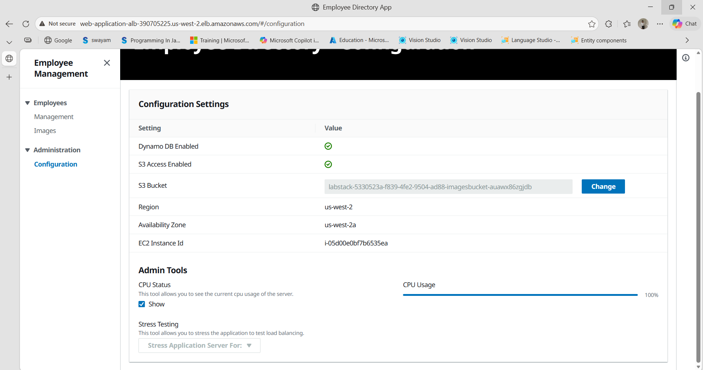

# 🚀 AWS High Availability Web Application

This project demonstrates how to build a highly available and scalable web application on AWS using EC2, Application Load Balancer, and Auto Scaling.

## 📌 Overview

The objective of this project is to ensure that a web application remains available, fault-tolerant, and scalable under varying loads by distributing traffic and automatically scaling resources.

## 🛠️ Services Used

- Amazon EC2 – Hosts the web application  
- Application Load Balancer (ALB) – Distributes incoming traffic  
- Auto Scaling Group (ASG) – Automatically scales instances  
- Amazon S3 – Stores application files  
- IAM Role – Provides secure access to AWS services  
- CloudWatch – Monitors and triggers scaling  

## ⚙️ Architecture

- Application deployed across multiple Availability Zones  
- Target Group configured for routing traffic  
- Launch Template created with user data script for automation  
- Auto Scaling Group attached to Load Balancer  

## 📸 Screenshots

### 🔹 Application Running (Load Balanced)

### 🔹 Configuration & Scaling

## 🔄 Key Features

- High Availability using multi-AZ deployment  
- Load balancing across multiple EC2 instances  
- Automatic scaling based on CPU utilization  
- Fault tolerance and improved reliability  

---

## 🧪 Testing

- Verified load balancing by observing Availability Zone changes  
- Performed stress testing to simulate high traffic  
- Observed automatic scaling of instances  

## ⚠️ Challenges Faced

- Unhealthy targets due to incorrect user data configuration  
- Fixed by updating:
  - S3 bucket names  
  - AWS region  
- Verified security groups and health check settings  

## 🎯 Outcome

- Successfully implemented a scalable and fault-tolerant architecture  
- Achieved automatic scaling and load distribution  
- Ensured application availability under load  

## 📚 Learnings

- Hands-on experience with AWS core services  
- Understanding of load balancing and auto scaling  
- Debugging real-world deployment issues  
